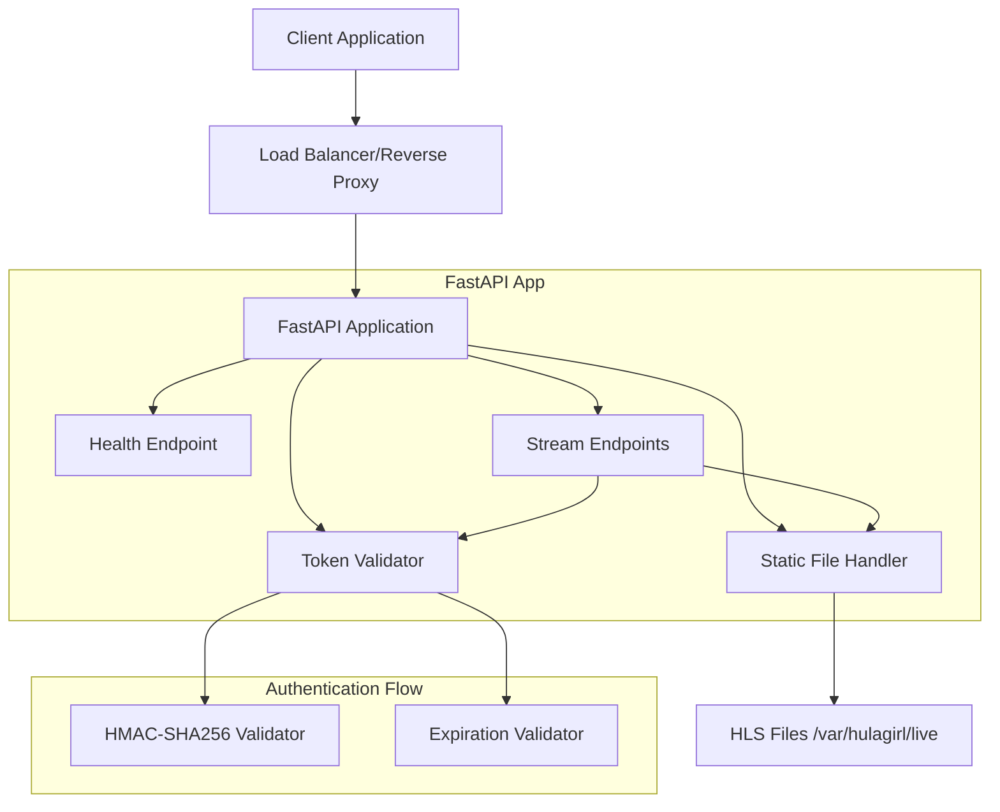

# Design Document

## Overview

The hulagirl-web application is a FastAPI-based HLS streaming server that provides secure, token-authenticated access to live video streams. The application follows a layered architecture with clear separation between authentication, file serving, and API concerns. It uses HMAC-SHA256 signatures for request validation and implements appropriate caching strategies for different content types.

## Architecture



The application consists of three main layers:
1. **API Layer**: FastAPI endpoints handling HTTP requests and responses
2. **Authentication Layer**: Token validation using HMAC-SHA256 signatures
3. **File Serving Layer**: Static file serving with appropriate headers

## Components and Interfaces

### 1. Main Application (main.py)

**FastAPI Application Setup**
- Configures FastAPI instance with appropriate middleware
- Registers route handlers for health and streaming endpoints
- Handles application startup and configuration validation

**Key Dependencies**:
- Environment configuration validation
- Token validator initialization
- Static file serving configuration

### 2. Token Validator (token.py)

**TokenValidator Class**
```python
class TokenValidator:
    def __init__(self, signing_secret: str)
    def validate_request(self, path: str, exp: int, sig: str) -> ValidationResult
    def _compute_signature(self, path: str, exp: int) -> str
    def _is_expired(self, exp: int) -> bool
```

**Validation Logic**:
- Expiration time checking against current Unix timestamp
- HMAC-SHA256 signature computation using path + exp as message
- Base64URL encoding without padding for signature comparison
- Path normalization to ensure consistent signature computation

**Error Handling**:
- Returns structured validation results with specific error types
- Distinguishes between expired tokens and invalid signatures

### 3. Route Handlers

**Health Endpoint**
- Simple JSON response without authentication
- Used for container health checks and monitoring

**Stream Endpoints**
- Dependency injection for token validation
- File existence checking before serving
- Appropriate Content-Type and Cache-Control headers

### 4. Configuration Management

**Environment Variables**:
- `EDGE_SIGNING_SECRET`: Required HMAC signing key
- `HLS_ROOT`: HLS files directory (default: /var/hulagirl/live)

**Validation**:
- Startup validation ensures required environment variables are present
- File system access validation for HLS_ROOT directory

## Data Models

### Request Models

**Token Parameters**
```python
class TokenParams:
    exp: int  # Unix timestamp
    sig: str  # Base64URL encoded signature (unpadded)
```

### Response Models

**Health Response**
```python
class HealthResponse:
    ok: bool = True
```

**Error Responses**
```python
class ErrorResponse:
    error: str  # "expired" | "forbidden" | "not_found"
```

### Internal Models

**Validation Result**
```python
class ValidationResult:
    is_valid: bool
    error_type: Optional[str]  # "expired" | "forbidden"
    status_code: Optional[int]  # 410 | 403
```

## Error Handling

### Authentication Errors

**Expired Token (410 Gone)**
- Triggered when current time > exp parameter
- Response: `{"error": "expired"}`
- Indicates the token was valid but has expired

**Invalid Signature (403 Forbidden)**
- Triggered when computed signature doesn't match provided signature
- Response: `{"error": "forbidden"}`
- Indicates tampering or incorrect token generation

**Missing Parameters (400 Bad Request)**
- Triggered when exp or sig query parameters are missing
- Response: `{"error": "missing_parameters"}`

### File System Errors

**File Not Found (404 Not Found)**
- Triggered when requested HLS file doesn't exist
- Standard FastAPI 404 response
- Applies to both .m3u8 and .ts files

**Permission Errors (500 Internal Server Error)**
- Triggered when file system access fails
- Logged for debugging but not exposed to client
- Generic 500 response to avoid information disclosure

### Configuration Errors

**Startup Validation**
- Missing EDGE_SIGNING_SECRET causes application startup failure
- Inaccessible HLS_ROOT directory causes startup failure
- Clear error messages logged for operational debugging

## Testing Strategy

### Unit Tests

**Token Validator Tests**
```python
# test_token_validator.py
- test_valid_signature_computation()
- test_invalid_signature_rejection()
- test_expired_token_rejection()
- test_path_normalization()
- test_base64url_encoding_without_padding()
```

**Signature Test Cases**:
- Valid signatures with various paths and expiration times
- Invalid signatures with tampered paths or exp values
- Edge cases: empty paths, special characters, case sensitivity
- Time-based tests: expired vs valid timestamps

### Integration Tests

**API Endpoint Tests**
```python
# test_api.py
- test_health_endpoint()
- test_m3u8_serving_with_valid_token()
- test_ts_serving_with_valid_token()
- test_expired_token_rejection()
- test_invalid_signature_rejection()
- test_file_not_found_handling()
- test_proper_content_types_and_headers()
```

**Test Environment Setup**:
- Temporary HLS directory with sample .m3u8 and .ts files
- Known EDGE_SIGNING_SECRET for predictable signature generation
- Mock time functions for testing expiration logic

**Header Validation Tests**:
- Verify Cache-Control: no-store for .m3u8 files
- Verify Cache-Control: public, max-age=10, immutable for .ts files
- Verify Content-Type: application/vnd.apple.mpegurl for .m3u8
- Verify Content-Type: video/mp2t for .ts files

### Performance Tests

**Load Testing Considerations**:
- Token validation performance under high request volume
- File serving performance for concurrent requests
- Memory usage with large .ts files

## Security Considerations

### Token Security

**HMAC-SHA256 Strength**:
- Cryptographically secure signature algorithm
- Secret key must be sufficiently random and protected
- Signature includes full request path to prevent path traversal

**Time-based Validation**:
- Prevents replay attacks with expired tokens
- Granular expiration control (Unix timestamp precision)

### File System Security

**Read-only Access**:
- HLS_ROOT mounted as read-only in container
- Application cannot modify or delete HLS files
- Prevents accidental or malicious file system changes

**Path Traversal Prevention**:
- FastAPI's static file serving includes built-in path traversal protection
- Additional validation in token signature computation

### Container Security

**Non-root Execution**:
- Application runs as non-privileged user
- Reduces attack surface in case of compromise
- Follows container security best practices

## Deployment Architecture

### Container Configuration

**Base Image**: python:3.11-slim (ARM64)
- Minimal attack surface
- Regular security updates
- Optimized for production use

**Runtime Configuration**:
- Non-root user (app:app)
- Read-only root filesystem where possible
- Health check endpoint for orchestration

### Volume Mounts

**HLS Content**:
- `/var/hulagirl/live` mounted read-only
- External content management (outside application scope)
- Supports dynamic content updates without container restart

### Environment Variables

**Required Configuration**:
- `EDGE_SIGNING_SECRET`: HMAC signing key (must be securely generated)
- `HLS_ROOT`: Content directory path (default: /var/hulagirl/live)

**Optional Configuration**:
- `PORT`: Application port (default: 8000)
- `HOST`: Bind address (default: 0.0.0.0)

## Monitoring and Observability

### Health Checks

**Container Health**:
- `/healthz` endpoint for container orchestration
- Simple boolean response for quick health assessment
- No authentication required for monitoring systems

**Application Metrics**:
- Request count and response time metrics
- Authentication success/failure rates
- File serving performance metrics

### Logging Strategy

**Structured Logging**:
- JSON format for log aggregation
- Request ID correlation for debugging
- Security event logging (authentication failures)

**Log Levels**:
- INFO: Normal operations, request handling
- WARN: Authentication failures, missing files
- ERROR: Configuration issues, system errors